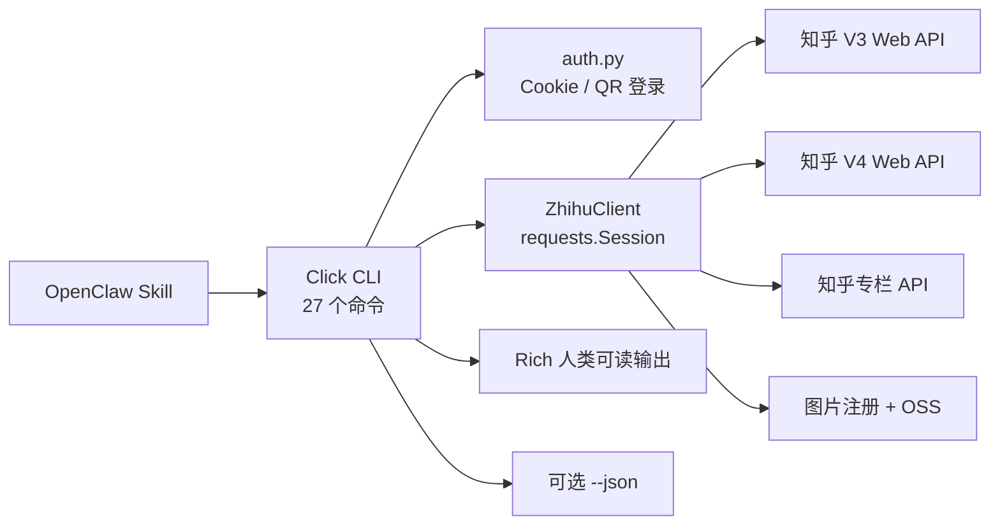
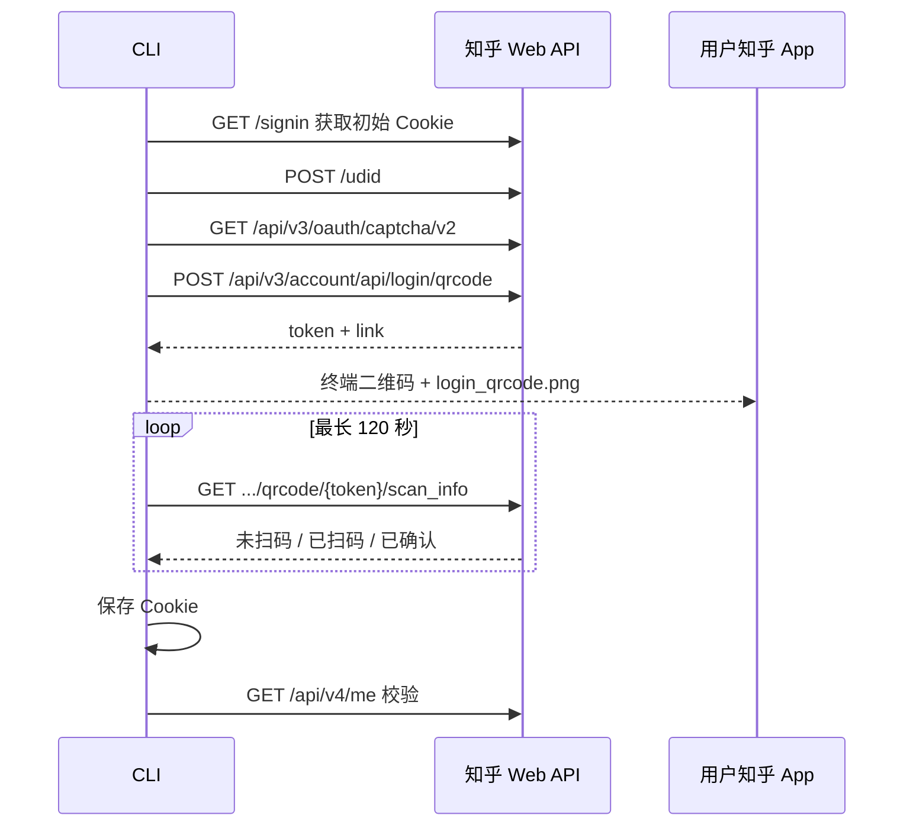

# Python `pyzhihu-cli` 竞品功能分析

## 1. 分析对象与结论

- 竞品目录：`/Users/nnnnzs/project/zhihu-cli`
- 竞品仓库：`BAIGUANGMEI/zhihu-cli`
- 分析提交：`8e32b99`
- 竞品包版本：`pyproject.toml` 与 `zhihu_cli/__init__.py` 为 `0.2.4`，`skill/SKILL.md` 标为 `0.2.6`
- 当前项目：`NNNNzs/zhihu-cli`（Node.js + pnpm）

结论：竞品的 CLI 广度更大，共注册 27 个子命令，覆盖扫码登录、用户、评论、话题、互动、收藏、通知、提问、想法、文章及删除；当前项目在回答创作链路上更完整，独有 Markdown 编译、回答草稿、发布预览、确认令牌、回答创建/更新和 GIF 图片上传。

功能目标应是“覆盖竞品已有能力 + 保留当前项目的回答创作优势”，但不照搬竞品的凭证传递和写操作安全模型。所有新增写能力仍应采用预览、显式确认、幂等检查和禁止自动重试。

## 2. 竞品架构概览

主要模块：

- `zhihu_cli/auth.py`：Cookie 保存、缺失 Cookie 补全、二维码生成和扫码状态轮询。
- `zhihu_cli/client.py`：读取、互动、图片和内容发布 API 封装。
- `zhihu_cli/commands/`：Click 命令与 Rich 输出。
- `skill/SKILL.md`：面向 OpenClaw 的命令映射和二维码转发流程。
- `tests/`：182 个测试函数，主要为解析、CLI mock 和 HTTP mock；没有真实知乎集成测试。

文档与代码还存在可见漂移：README 使用过 `question --answers` 和互动操作 `--undo`，实际命令分别是独立的 `answers`、`vote --neutral` 与 `follow-question --unfollow`。因此后续只把竞品源码和测试作为功能存在的依据，README 用于理解产品意图。

## 3. 功能矩阵

状态说明：

- ✅：已有等价或更强能力。
- ◐：部分覆盖，参数、对象类型或体验不足。
- ❌：当前缺失。
- ⭐：当前项目独有，应保留。

### 3.1 认证与账户

| 能力 | Python 竞品 | 当前项目 | 差距与建议 |
|---|---|---|---|
| 二维码扫码登录 | `zhihu login --qrcode`；终端渲染并保存 PNG | ❌ | P0。新增前台扫码登录流程，二维码保存为 `~/.zhihu-cli/login_qrcode.png`，同时在 JSON 中返回图片路径和状态 |
| Cookie 导入 | `--cookie` 命令行参数 | ✅ stdin 导入 | 保留当前 stdin 方案；不得引入会泄漏到历史记录和进程列表的 `--cookie` |
| 登录状态 | 离线检查本地 Cookie 是否存在 | ✅ 在线校验并返回账户 | 当前更可靠；可增加 `--offline` 作为快速检查 |
| 当前用户 | `whoami [--json]` | ◐ `auth status` 内返回账户 | 增加独立 `account show` 或 `auth whoami`，并保留现有结构化输出 |
| 退出登录 | `logout` 删除 Cookie 文件 | ❌ | P0。新增可恢复范围明确的本地凭证清理；同时删除过期二维码 |
| 自动补齐 `_xsrf` / `d_c0` | 有 `z_c0` 时访问知乎首页补齐 | ❌ | 可选。必须只请求知乎允许域名并避免覆盖有效值 |
| 二维码供 Agent 转发 | PNG 固定路径，Skill 说明 OpenClaw 发送方式 | ❌ | P0。CLI 只生成本地图片；具体发送由各 Agent 宿主负责，避免绑定 OpenClaw CLI |

### 3.2 内容读取

| 能力 | Python 竞品 | 当前项目 | 差距与建议 |
|---|---|---|---|
| 综合搜索 | general / people / topic | ◐ general，偏问题检索 | P1。补 people、topic，并保留原始类型和分页 |
| 热榜 | 热榜，可为每个问题附带回答 | ✅ 热榜列表 | P1。增加可选回答展开，避免默认 N+1 请求 |
| 推荐 Feed | 列表与“内容+评论”两种模式 | ◐ recommend 列表 | P1。增加展开内容、评论和分页；保持 JSON 一致 |
| 问题详情 | ✅ | ✅ | 已覆盖 |
| 问题回答列表 | ✅ | ✅ | 统一 sort 枚举和分页字段 |
| 单个回答详情 | ✅ | ❌ | P1。增加 `answer show` |
| 回答评论 | ✅，支持分页抓取全部 | ❌ | P1。增加 `answer comments`，默认必须有限 limit，避免无界请求 |
| 用户资料 | ✅ | ❌ | P1。增加 `user show` |
| 用户回答 | ✅ | ❌ | P1。增加 `user answers` |
| 用户文章 | ✅ | ❌ | P1。增加 `user articles` |
| 粉丝 / 关注 | ✅ | ❌ | P1。增加分页查询 |
| 话题详情 / 热门问题 | ✅ | ❌ | P1。增加 `topic show` 与 `topic questions` |
| 收藏夹 | 仅收藏夹列表 | ❌ | P1。先对齐列表；收藏夹内容可另列扩展 |
| 通知 | recent 通知和 offset | ❌ | P1。新增只读命令，默认不修改已读状态 |

### 3.3 互动与发布

| 能力 | Python 竞品 | 当前项目 | 差距与建议 |
|---|---|---|---|
| 赞同 / 取消赞同回答 | ✅ | ❌ | P2。写操作需要 preview + confirm，不能收到自然语言请求后直接 POST |
| 关注 / 取消关注问题 | ✅ | ❌ | P2。同样使用 preview + confirm |
| 发布提问 | 纯文本/HTML、话题、图片 | ❌ | P3。实现草稿/预览/确认发布，复用图片上传与 Markdown 编译 |
| 发布想法 | 标题、正文、图片 | ❌ | P3。先验证当前 Web payload；竞品 payload 只能作线索 |
| 发布文章 | 标题、正文、话题、图片 | ❌ | P3。需要同时验证专栏旧接口和统一发布接口 |
| 删除自己的提问 | 有交互确认或 `-y` | ❌ | P3。Agent 场景不提供无条件 `-y`，改用绑定对象与账户的确认令牌 |
| 删除自己的想法 | 同上 | ❌ | P3 |
| 删除自己的文章 | 同上 | ❌ | P3 |
| 保存回答草稿 | ❌ | ⭐ ✅ | 保留 |
| 发布回答 | 竞品 README 明确未完成 | ⭐ ✅ | 保留 |
| 更新已有回答 | ❌ | ⭐ ✅ | 保留 |
| 回答发布预览和确认令牌 | ❌ | ⭐ ✅ | 推广到所有写操作 |

### 3.4 内容与图片处理

| 能力 | Python 竞品 | 当前项目 | 结论 |
|---|---|---|---|
| 图片注册与 OSS 上传 | ✅，单次 PUT | ✅，包含复用、单次 PUT、GIF multipart、状态轮询 | 当前更强 |
| 图片格式识别 | OSS Content-Type 固定为 JPEG | ✅ PNG/JPEG/GIF/WebP 检测 | 当前更安全 |
| Markdown 编译 | ❌ | ⭐ ✅ 表格、代码、公式、图片 | 保留并复用于提问/想法/文章 |
| HTML 安全处理 | 内容直接拼接 HTML | ✅ 过滤不安全 URL 和原始 HTML | 当前更强 |
| 文章富文本 | 竞品命令层会把正文整体包在 `
` 中 | ❌文章发布，但编译器可复用 | 实现时以 Markdown 编译结果为主，不复制竞品字符串拼接方式 |

### 3.5 CLI、分发与 Agent 体验

| 能力 | Python 竞品 | 当前项目 | 差距与建议 |
|---|---|---|---|
| 全局可执行命令 | `zhihu` | package bin 为 `zhihu-cli`，开发时 `pnpm zhihu` | P0。正式分发时同时提供 `zhihu` bin，保留 `zhihu-cli` 别名 |
| 人类可读终端输出 | Rich 表格、颜色、提示 | 仅 JSON | P4。默认 JSON 对 Agent 更稳；可增加 `--format table`，不要改变机器默认 |
| JSON 输出 | 多数命令可选 `--json`，存在例外 | 所有成功结果统一 JSON | 当前更一致 |
| 版本命令 | `--version` | ❌ | P0。增加 `--version` |
| 调试日志 | `-v` | ❌ | P4。日志必须脱敏并写 stderr |
| 包管理分发 | PyPI + uv/pipx/pip | 源码 + pnpm，package 为 private | P0/P4。决定 npm 发布名、移除 private、验证 `pnpm dlx` / 全局安装 |
| OpenClaw 分发 | ClawHub | 通用 Agent Skill，Hermes 元数据 | P4。增加标准 Skill 安装路径和 OpenClaw 文档，不把核心 Skill 绑定单一宿主 |
| Agent 查询规则 | Skill 要求查询命令使用 JSON | Skill 已以 JSON CLI 为基础 | 当前更自然 |

## 4. 扫码登录专项分析

竞品流程如下：

实现时需要改进的点：

1. 竞品称其为“官方 API”，但这是知乎未公开承诺稳定的 Web 接口，不应在我们的文档中称为官方 SDK/API。
2. 竞品没有二维码网络流程测试，测试只覆盖 Cookie 解析、文件保存和二维码字符渲染。
3. 竞品每 0.15 秒轮询一次，120 秒内理论上可达约 800 次请求，存在频率限制和风控风险。建议初始 1 秒，扫码后 0.5 秒，并带上限与服务端状态驱动。
4. 二维码 PNG 内含临时登录令牌，应使用 `0600` 权限；成功、超时、取消或 logout 后删除。
5. 登录必须是前台、可中断流程，不启动后台服务。Agent 获取图片路径后可把图片交付给用户，但不能把 Cookie 输出到 stdout。
6. 扫码成功后应原子写入 `~/.zhihu-cli/config.json`，目录 `0700`、文件 `0600`，并保留现有 Cookie 配置结构。
7. 命令建议采用 `zhihu auth login --qr`，同时提供简短别名 `zhihu login --qr`；输出事件应为 JSON Lines 或一个最终 JSON，明确 `qr_ready`、`scanned`、`confirmed`、`expired` 状态。

## 5. 竞品可借鉴但不应照搬的设计

### 可直接借鉴的产品能力

- 扫码登录和二维码图片落地。
- `logout`、`whoami`、`--version`。
- 单回答、评论、用户、话题、收藏和通知读取。
- 点赞、关注、提问、想法、文章与删除能力。
- 清晰的命令映射和 OpenClaw 二维码交付说明。
- 发布渠道与版本升级说明。

### 不应照搬的实现与安全行为

- `--cookie "..."`：Cookie 会进入 shell 历史、Agent 记录和进程参数；继续只允许 stdin 或本地剪贴板读取。
- 发布提问、想法、文章后立即写入：应先 preview，再使用与账户、目标和内容绑定的确认令牌。
- 删除命令的 `-y`：对人类 CLI 可以存在，但 Agent 不应无条件跳过确认。
- 二维码 0.15 秒固定高频轮询：改为有限频率和可取消状态机。
- 二维码图片长期保留且未显式收紧权限：成功/失败后清理。
- 所有读取命令强制登录：公开读取能力应尽量允许匿名调用。
- 图片 Content-Type 固定 JPEG：继续使用当前项目的格式检测和 GIF multipart。
- 直接拼接用户 HTML：继续通过 Markdown 编译器和安全 URL 策略。
- HTTP 客户端缺少统一域名 allowlist：继续保留当前项目的知乎域名边界。

## 6. 实施优先级

### P0：身份、命令与分发基础

1. 扫码登录：QR token、PNG、终端/Agent 交付、轮询状态机、登录校验与清理。
2. `auth logout`、`auth whoami`、`--version`。
3. `zhihu` 与 `zhihu-cli` 两个 bin；规范正式安装命令。
4. 将 CLI 拆分为 `commands/`、`client/`、`auth/`，避免继续扩大单文件入口。
5. 为扫码流程建立纯 mock 单元测试和可显式开启的集成测试。

### P1：只读能力全覆盖

1. 单回答与评论。
2. 用户资料、回答、文章、粉丝和关注。
3. 话题详情与热门问题。
4. 收藏夹和通知。
5. 搜索类型、Feed 展开、热榜回答展开与统一分页。

### P2：轻量互动

1. 回答赞同/取消。
2. 问题关注/取消。
3. 为两类操作实现 preview/confirm 和远端状态校验。

### P3：内容类型扩展

1. 提问：Markdown、话题、图片、preview/confirm。
2. 想法：Markdown、图片、preview/confirm。
3. 文章：Markdown、话题、图片、草稿、preview/confirm。
4. 删除提问、想法、文章：对象详情预览、账户校验和一次性确认令牌。

### P4：人类 CLI 与生态体验

1. 可选 Rich 风格表格或等价终端渲染。
2. 脱敏 verbose 日志。
3. npm/pnpm 全局安装与升级。
4. OpenClaw/ClawHub、Hermes 和 Codex 的分发说明与安装验证。

## 7. 验收标准

“竞品有的我都要有”应以以下条件判断，而不是仅以命令存在判断：

- 每项能力有稳定命令、结构化 JSON schema、错误类型和文档。
- 每个 HTTP 接口有 mock 测试；高风险接口有手动集成验证记录。
- Cookie、二维码令牌和响应头不会进入日志或错误输出。
- 所有外部写操作先预览、再显式确认，并且不自动重试。
- 所有删除操作校验当前账户、目标类型和对象 ID。
- API 目标受域名 allowlist 限制；不绕过 CAPTCHA、频率限制和风控。
- Agent Skill 与 CLI 文档使用同一命令和安全边界，不出现版本漂移。

## 8. 最终产品边界

完成对齐后，项目应定位为：

> 面向人类与 AI Agent 的完整知乎 CLI：支持安全登录、内容检索与阅读、用户和话题研究、互动、Markdown 创作、多类型内容发布与受确认保护的写操作。

当前项目的核心差异化不是“比竞品多几个命令”，而是把知乎 CLI 的广度与回答创作链路的安全性结合起来。
